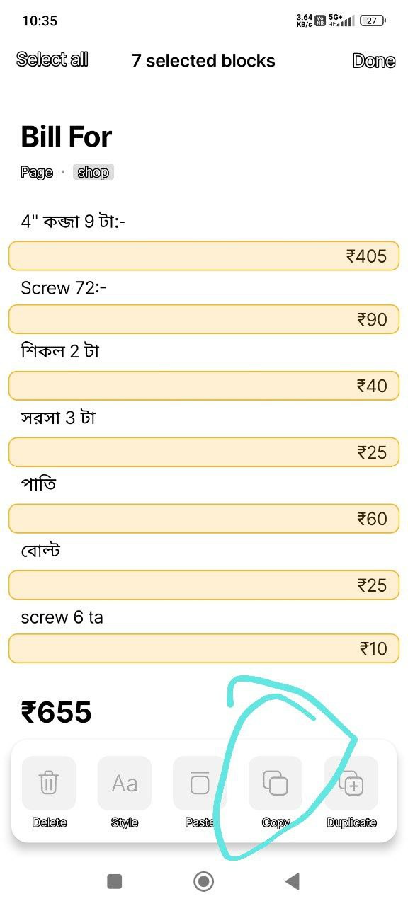
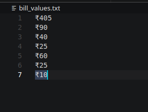

# How this will work.

The Below copy > then i need to paste those so that i can get the total.

After the Copy This looks like.

# Logic To Make This code

1. First i need to make a List of The valeus.
2. I need to remove the `₹` sign from the items of the list.
3. I need to convert to int so that i can use addition (+) to this list.
4. I will get the sum value using the build in `sum()`.